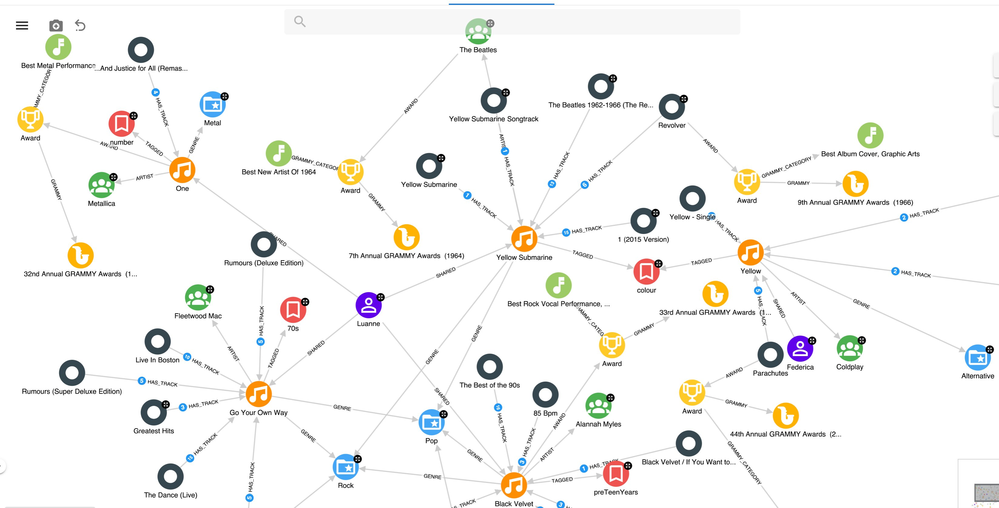

# Advent of Songs Knowledge Graph

[Michael Simons](https://twitter.com/rotnroll666) shared on Twitter the idea of doing the Advent of Songs instead of the typical advent of code.

We started it internally as well and we had so much fun that we did a Knowledge Graph out of it.

Here an overview of it 



---

## Configuration as code

This repository contains the configuration as code for re-creating this KG with [Hume](https://graphaware.com/products/hume).

## GraphQL API

A GraphQL API is also available for querying the KG, contact [me](https://twitter.com/ikwattro) for receiving an API Key.

```bash
{
  song(first: 2) {
		_all
		Person_SHARED {
			_from {
				name
			}
		}
		Album_HAS_TRACK {
			_from {
				name
			}
		}
	}
}
```

```bash
{
	"errors": [],
	"data": {
		"song": [
			{
				"explicit": null,
				"Album_HAS_TRACK": [],
				"_id": 1,
				"title": "Back in Black",
				"Person_SHARED": [
					{
						"_from": {
							"name": "Christophe"
						}
					}
				],
				"url": "https://youtu.be/pAgnJDJN4VA",
				"_labels": [
					[
						"Song"
					]
				]
			},
			{
				"explicit": "notExplicit",
				"Album_HAS_TRACK": [
					{
						"_from": {
							"name": "The Beatles 1962-1966 (The Red Album)"
						}
					},
					{
						"_from": {
							"name": "Yellow Submarine Songtrack"
						}
					},
					{
						"_from": {
							"name": "Revolver"
						}
					},
					{
						"_from": {
							"name": "1 (2015 Version)"
						}
					},
					{
						"_from": {
							"name": "Yellow Submarine"
						}
					}
				],
				"_id": 4,
				"title": "Yellow Submarine",
				"Person_SHARED": [
					{
						"_from": {
							"name": "Luanne"
						}
					}
				],
				"url": "https://youtu.be/m2uTFF_3MaA",
				"_labels": [
					[
						"Song"
					]
				]
			}
		]
	},
	"extensions": null,
	"dataPresent": true
}
```

